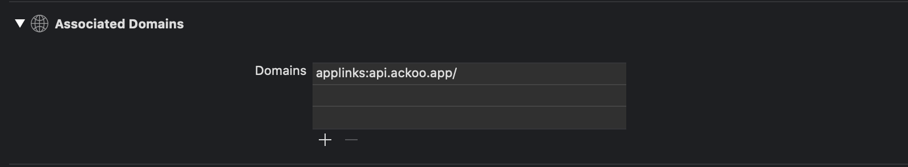

# AckooSDK

[](https://travis-ci.org/mihirpmehta/AckooSDK)
[](https://cocoapods.org/pods/AckooSDK)
[](https://cocoapods.org/pods/AckooSDK)
[](https://cocoapods.org/pods/AckooSDK)

## Example
To run the example project, clone the repo, and run `pod install` from the Example directory first.

## Usage 
To be able to run Ackoo SDK correctly you need to enable the following setps

# Table of Contents
1. [Installation](#installation)
2. [Configuration](#Configuration)
3. [Initialization](#Initialization)
4. [Verification](#Verification)

## Installation

AckooSDK is available through [CocoaPods](https://cocoapods.org). To install
it, simply add the following line to your Podfile:

```ruby
pod 'AckooSDK'
```

## Configuration
> retrive your `universalDomain` , and `app-token` from your Ackoo dashboard or your account manager
#### 1. Configure Info.plist
set "app-token" with your partner app token
#### 2. Configure Associated Domains
1. in Xcode, go to the Capabilities tab of your project file.
2. add your universal link under associated domains


## Initialization
### AppDelegate

1. Initalise SDK  in **application(_ application: UIAfpplication, didFinishLaunchingWithOptions launchOptions: [UIApplication.LaunchOptionsKey: Any]?) -> Bool {** in your Appdelegate class 

```swift
func application(_ application: UIApplication, didFinishLaunchingWithOptions launchOptions: [UIApplication.LaunchOptionsKey: Any]?) -> Bool {
    AckooSDKManager.shared().initSession();
}
```
2. Implement **application(_ application: UIApplication, continue userActivity: NSUserActivity, restorationHandler: @escaping ([UIUserActivityRestoring]?) -> Void) -> Bool {** in your Appdelegate class or SceneDelegate class

```swift
func application(_ application: UIApplication, continue userActivity: NSUserActivity, restorationHandler: @escaping ([UIUserActivityRestoring]?) -> Void) -> Bool {
    AckooSDKManager.shared().continueActivity(userActivity: userActivity)
}
//if you are using scenes
func scene(_ scene: UIScene, continue userActivity: NSUserActivity) {
    AckooSDKManager.shared().continueActivity(userActivity: userActivity)
}
```


From here you will get information for which product the user has opened you application. 


You can check if the current user is valid AckooSDK user or not by calling below method 
```swift

AckooSDKManager.shared().isUserValidForSDK {
    (activationState) in

    if case .active(let sessionToken) = activationState {
        self.showAlert(title: "Ackoo SDK is Active", message: "sessionToken : \(sessionToken)")
    } else if case .inactive(let errorCode, let errorMessage) = activationState {
        self.showAlert(title: "Ackoo SDK is Inactive", message: "code : \(errorCode), message: \(errorMessage)")
    }
    
}
```

### verification 
##### testing universal
open the following link on a device with your app installed
- `https://api.ackoo.app/partner/<partnerId>`
##### testing working basic integration
download the ackoo app and click on your partner link

call `AckooSDKManager.shared().isUserValidForSDK` and make sure it returns a session token


### error messages

 
## Important Note
This SDK uses advertisingIdentifier for purpose if identifying user after fresh installation after navigating from the Ackoo app. When you submit the app please tick **"Attribute this App Installation to a Previously Served Advertisement"** Please refer this screen shot


## Author

Ackoo, khaled@ackoo.app


